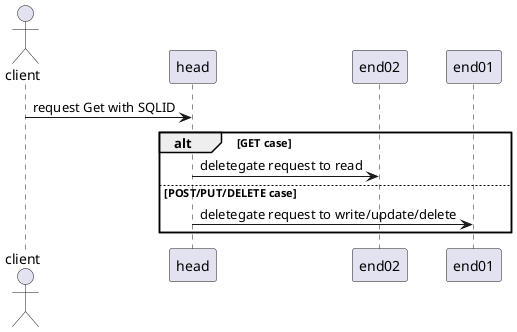

# lab-istio

## Step1
> This is test code for virtual service using istio

> Call method definition : /api/[endpoint]/[port]/[param]

```plantuml
@startuml
actor client

client -> head : request Get with SQLID
alt GET case
    head -> end02 : deletegate request to read
else POST/PUT/DELETE case
    head -> end01 : deletegate request to write/update/delete
end
@enduml
```

jwyoondarum
darumms
kkphil83
cutepeon
idstone